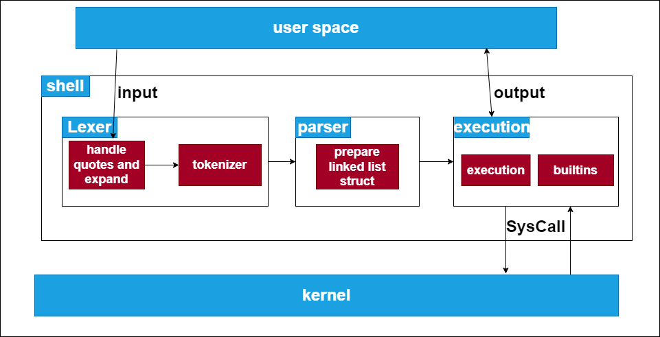

# Minishell

Minishell is a simplified version of a **shell** or **command-line** interface implemented in **C**. It provides basic shell functionality, including executing commands, handling input/output redirection, managing background processes, and implementing built-in commands.



*Figure 1: Diagram of the sheLL architecture*
## Features

- Display a prompt when waiting for a new command.
- Working history functionality.
- Search and launch the right executable (based on the **PATH** variable or using a relative or absolute path).
- No more than one global variable.
- No interpretation of unclosed quotes or unnecessary special characters.
- Handling of single quotes **(')**, preventing interpretation of metacharacters in the quoted sequence.
- Handling of double quotes **(")** except for **$** (dollar sign) metacharacter.
- Redirections:
  - `<` redirects input.
  - `>` redirects output.
  - `<<` reads input until a line containing the delimiter is seen.
  - `>>` redirects output in append mode.
- Pipes `|` for command pipelines.
- Handling of environment variables (`$` followed by a sequence of characters) for expansion.
- Handling of `$?` for expanding the exit status of the most recently executed foreground pipeline.
- Handling of **ctrl-C**, **ctrl-D**, and **"ctrl-\\"** signals.
- Interactive mode behavior:
  - **ctrl-C**, displays a new prompt on a new line.
  - **ctrl-D** exits the shell.
  - **"ctrl-\\"** does nothing.
- Built-in commands:
  - `echo` with option `-n`.
  - `cd` with only a relative or absolute path.
  - `pwd` with no options.
  - `export` with no options.
  - `unset` with no options.
  - `env` with no options or arguments.
  - `exit` with no options.

## Lexer

The lexer component of Minishell is responsible for tokenizing user input. It takes the raw input string and breaks it down into individual tokens, considering spaces, quotes, and special characters. The lexer performs the following tasks:

- Handles single quotes **`'`**, double quotes **`"`** to identify quoted sequences.
- Identifies and separates commands, arguments, input/output redirection symbols, pipes, and other special characters.
- throw an error if unnecessary characters such as backslashes **`\`** or semicolons **;** that are not required by the project's specifications. <br/>


There is various tokens are defined using `#define` statements to assign meaningful names to their corresponding integer values. These tokens provide a way to identify different elements during the lexical analysis phase:

- **PIPE (1)**: Represents a pipe symbol ('|') indicating a command pipeline.
- **IN (2)**: Represents input redirection symbol ('<') indicating input redirection from a file.
- **OUT (3)**: Represents output redirection symbol ('>') indicating output redirection to a file (overwrite mode).
- **HERDOC (4)**: Represents the heredoc symbol ('<<') indicating input redirection from a here-document.
- **OUTP (5)**: Represents output redirection symbol ('>>') indicating output redirection to a file (append mode).
- **STRING (6)**: Represents a regular string token.
- **HERDOCX (7)** same as herdoc but to handle expend inside herdoc.

**The Master token**
```c
# define PIPE 1
# define IN 2
# define OUT 3
# define HERDOC 4
# define HERDOCX 7
# define OUTP 5
# define STRING 6
```
```c
t_minishell	*parsing(char *command, t_env *env)
{
	t_list		*s;
	t_minishell	*list;

	s = command_string(command, env);
	free(command);
	if (!s)
		return (NULL);
	s = concatnate_strings(s);
	s = lexer_list(s);
	if (!s)
		return (NULL);
	list = parser_job(s);
	ft_lstclear(&s);
	if (!check_herdoc(list, env))
	{
		ft_lstclear_minishell(&list);
		return (NULL);
	}
	return (list);
}
```
###  Let's break down the steps of lexer involved:
1. For handling double, signle quote and expend. The **command_string** function is called, passing the command string and the environment context. This function converts the command string into a linked list called **s**, with each node containing a string and a token value. This token have 3 values **1, 0 and -1**.

```c
s = command_string(command, env);
```
2. The original command string is freed since it's no longer needed.
```c
free(command);
```
3. If the linked list s is empty, indicating an error, the parsing function returns **`NULL`**.
```c
if (!s)
    return (NULL);
```
4. The **concatenate_strings** function is called to concatenate the strings in the linked list s by thier value from **command_string** fucntion, creating a **master token**.
- All the node with 1 and -1 concatinate with each other untile they stop in node with 0 and provide the master token, the token containe -1 gonna be directly a string and other gonna get their token defined in the lexer.
```c
s = concatenate_strings(s);
```
5. The **lexer_list** function is called to further process the linked list **`s`**, performing lexical analysis or tokenization.
```c
s = lexer_list(s);
```
6.  If the resulting linked list **`s`** is empty, indicating an error, the parsing function returns **`NULL`**.
```c
if (!s)
    return (NULL);
```

By using these tokens, the lexer effectively breaks down the input string into meaningful units, which are later used for parsing and executing the commands in the Minishell project.

## Parser

The parser component of Minishell takes the tokens produced by the lexer and performs syntactic analysis to build a parse Linked List. It ensures that the input adheres to the grammar rules of the shell and the requirement in the project. The parser performs the following tasks:

- Validates the order and structure of the tokens to ensure correct command syntax.
- Handles command pipelines by grouping commands and setting up pipe connections between them.
- Recognizes input/output redirection operators and builds the necessary data structures for redirection.
- Identifies and separates built-in commands from external commands, preparing them for execution.
### Command Structure
The command structure is represented using the t_minishell struct, defined as follows:
```c
typedef struct s_minishell {
    char        **command;
    t_files     *in;
    t_files     *out;
    struct s_minishell    *next;
} t_minishell;
```

The t_minishell struct contains the following members:
- `command`: A double pointer to a character array (`char **`) that stores the command and its arguments as individual strings. The command itself is stored in `command[0]`, and the subsequent arguments follow in `command[1]`, `command[2]`, and so on. The last element of the array is set to `NULL`.
- `in`: A pointer to a structure of type `t_files`, representing the input file redirection for the command. This structure contains information about the input file, such as its name and file descriptor.
- `out`: A pointer to a structure of type `t_files`, representing the output file redirection for the command. This structure contains information about the output file, such as its name and file descriptor.
- `next`: A pointer to the next node in the linked list, allowing for the representation of pipe and if the next is null i mean there's no more pipe.
- The `t_files` struct represent the input (in && herdoc) and output (out && append) file redirections for each command in the Minishell project.
```c
typedef struct s_files {
	char			*name;
	int				type;
	struct s_files	*next;
}	t_files;
```

```c
t_minishell	*parsing(char *command, t_env *env)
{
	t_list		*s;
	t_minishell	*list;

	s = command_string(command, env);
	free(command);
	if (!s)
		return (NULL);
	s = concatnate_strings(s);
	s = lexer_list(s);
	if (!s)
		return (NULL);
	list = parser_job(s);
	ft_lstclear(&s);
	if (!check_herdoc(list, env))
	{
		ft_lstclear_minishell(&list);
		return (NULL);
	}
	return (list);
}
```
### Let's break down the steps of parser involved:
1. The **parser_job** function is called to parse the linked list **s** and create a **t_minishell** list called list.
```c
list = parser_job(s);
```
2. The **ft_lstclear** function is called to clear the linked list s and free memory.
```c
ft_lstclear(&s);
```
3. The **check_herdoc** function is called to check for heredoc syntax in the list. If it fails, indicating an error, memory is freed, and **NULL** is returned.
```c
	if (!check_herdoc(list, env))
	{
		ft_lstclear_minishell(&list);
		return (NULL);
	}
```
3. Finally, the list is returned as the result of the parsing function to be executed.
```c
return (list);
```
## Execution

The execution component of Minishell takes the parse tree or AST generated by the parser and executes the commands accordingly. It performs the following tasks:

- Executes external commands by creating child processes using the fork() system call.
- Handles input/output redirection by setting up the appropriate file descriptors and using the dup2() system call.
- Implements command pipelines by connecting the output of one command to the input of another using pipes and the pipe() system call.
- Handles background processes by managing process IDs (PIDs) and signaling when they complete.
- Manages environment variables and their expansion by utilizing the getenv() function and replacing $ with their corresponding values.

## Built-in Functions

Minishell implements several built-in functions that provide additional functionality and control. The implementation of each built-in function is specific to the respective command. Here is a summary of the built-in functions:

- echo with option -n: Handles the -n option to suppress trailing newline characters in the output.
- cd: Supports changing the current working directory to a specified relative or absolute path.
- pwd: Prints the current working directory.
- export: Adds or modifies environment variables.
- unset: Removes environment variables.
- env: Prints the environment variables.
- exit: Exits the Minishell.

## Functions used

The following functions are allowed for use in the Minishell project:


 - readline, rl_on_new_line, rl_replace_line, rl_redisplay, add_history, printf, malloc, free, write, access, open, read, close, fork, waitpid, signal, exit, getcwd, chdir, stat, execve, dup, dup2, pipe, perror.

## Getting Started
### Prerequisites
- C Compiler: Install a C compiler (**GCC**) on your system.
### Installation

1. Clone the repository to your local machine:
```shell
git clone https://github.com/aminekh1/minishell.git
```
2. Navigate to the project directory:

```shell
cd minishell
```
3. Build the project using the provided Makefile:

```shell
make
```
This will compile the source code and generate the executable file.
### Usage

1. Run the Minishell:

```shell
./minishell
```
This will start the Minishell, and you can now start entering commands.
2. Enter commands at the prompt:

```shell
minishell> ls -l
```
### Makefile Targets
- `make`: Build the Minishell executable.
- `make clean`: Clean the build artifacts.
- `make fclean`: Clean the build artifacts and remove the executable.


